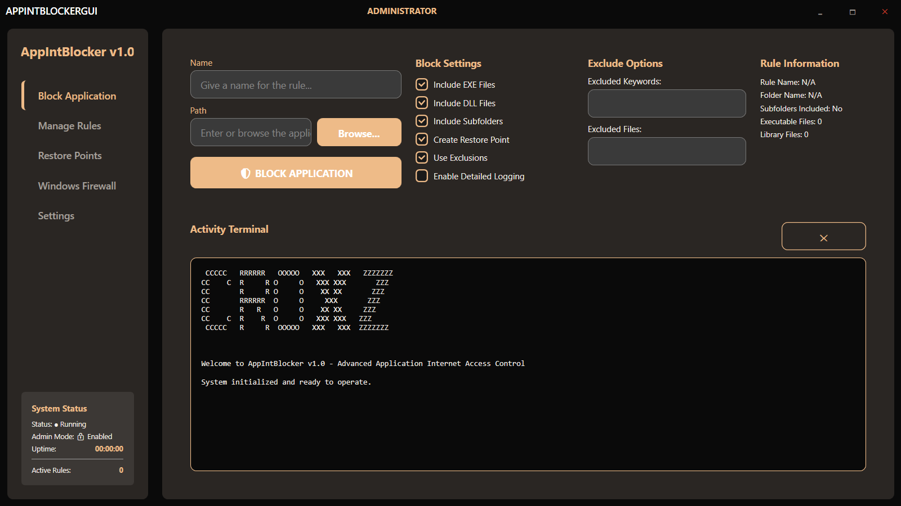
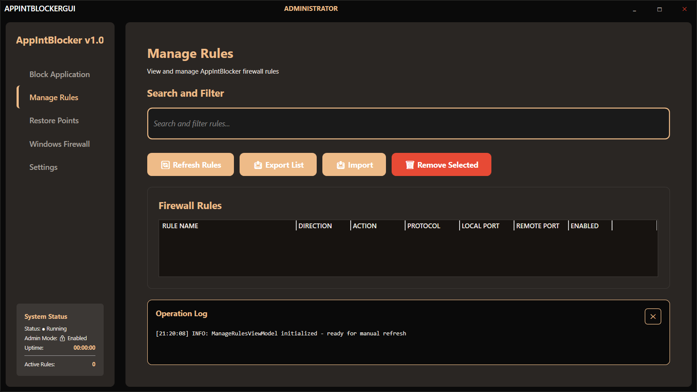
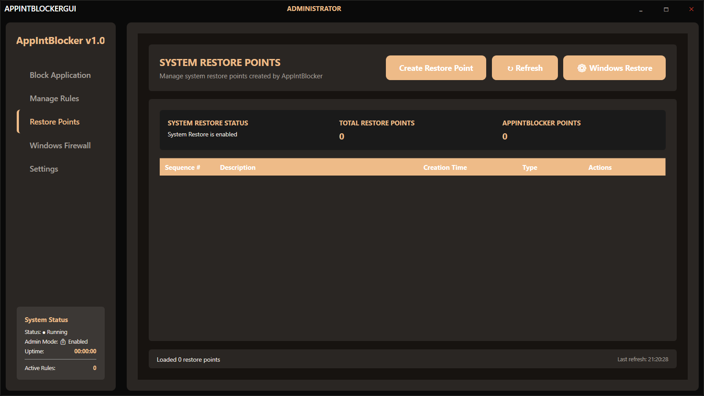
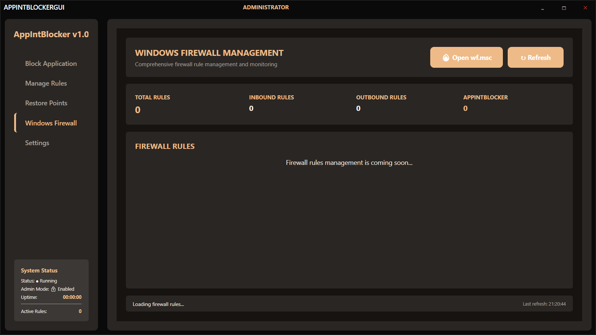
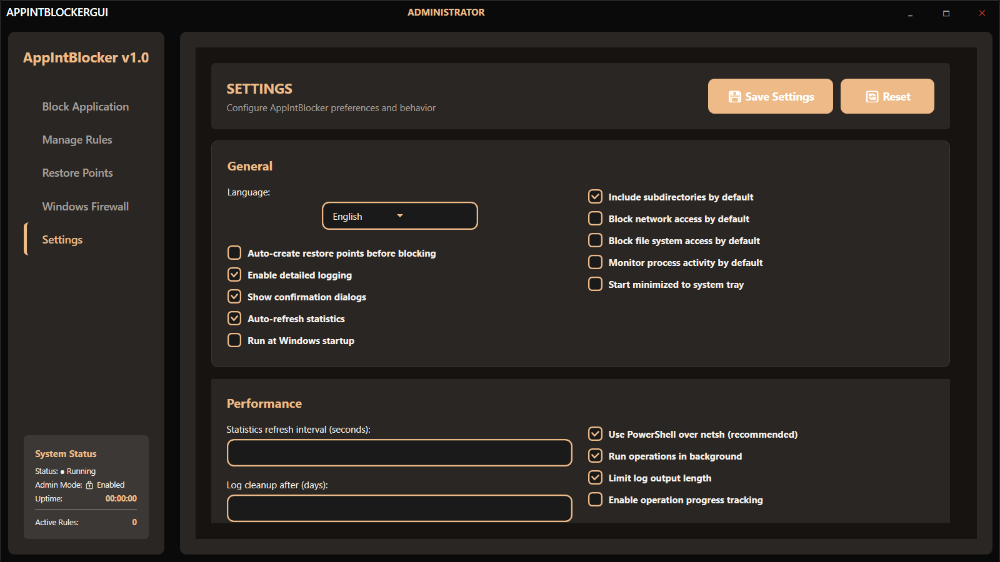
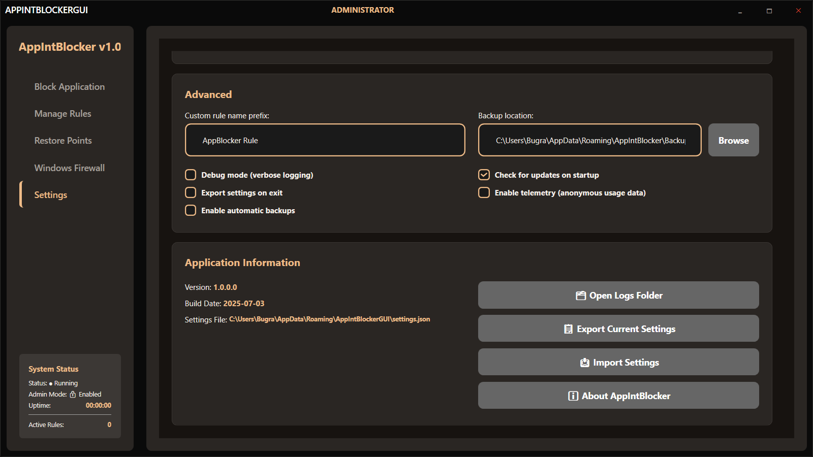
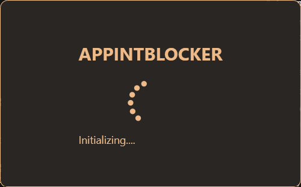
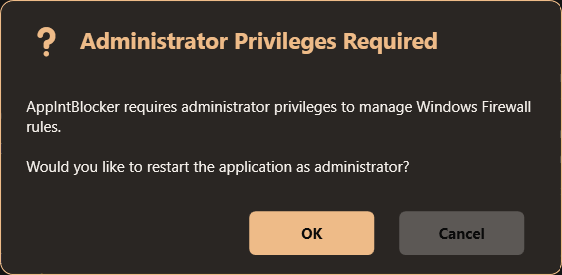
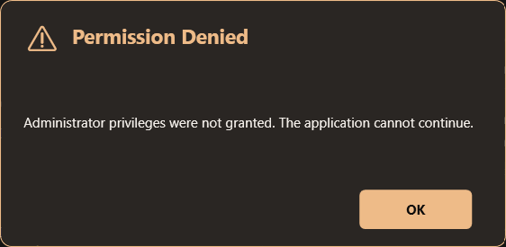
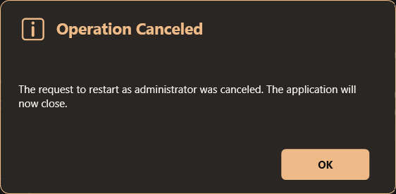

⚠️ **Disclaimer:** This project is currently under active development and in a pre-release state. Features may be unstable or subject to change. Please use with caution.

# AppIntBlockerGUI v1.0



### Additional Views

| Manage Rules | Restore Points | Windows Firewall | Settings (General) | Settings (Theme) |
| :---: | :---: | :---: | :---: | :---: |
|  |  |  |  |  |

### Loading & Dialogs

| Loading Screen | Admin Privileges | Permission Denied | Operation Cancelled |
| :---: | :---: | :---: | :---: |
|  |  |  |  |


**Professional Windows Application Firewall Manager with Modern UI**

[](https://dotnet.microsoft.com/download)
[](https://git-scm.com/downloads)
[](LICENSE)
[](https://www.microsoft.com/windows)

## Overview

AppIntBlockerGUI is a sophisticated Windows application that provides an intuitive interface for managing Windows Firewall rules. Built with modern WPF technology and following MVVM architectural patterns, it offers enterprise-grade firewall management capabilities with a beautiful, user-friendly interface.

Developed with the assistance of advanced AI models including Claude 4 Sonnet and Gemini 2.5 Pro to ensure modern architectural patterns and best practices.

## Features

### Core Functionality
- **Application Blocking**: Easily block applications from network access
- **Rule Management**: Create, edit, and delete firewall rules with advanced options
- **Network Monitor**: Real-time dashboard showing per-process bandwidth usage with a live graph.
- **One-Click Blocking**: Instantly block or unblock any process from the network monitor.
- **Restore Points**: Create and restore firewall configuration snapshots
- **Windows Firewall Integration**: Direct integration with Windows Firewall API
- **Real-time Monitoring**: Live status updates and rule validation
- **Administrator Privilege Management**: Automatic privilege checking and elevation

### Technical Excellence
- **MVVM Architecture**: Clean separation of concerns
- **Dependency Injection**: Microsoft.Extensions.DependencyInjection
- **Async/Await Patterns**: Non-blocking UI operations
- **Error Handling**: Comprehensive exception management
- **Logging System**: Detailed application logging
- **Performance Optimized**: Efficient rule scanning and management

## Quick Start

### Prerequisites
- Windows 10/11
- .NET 8.0 SDK or Runtime
- Git (command-line tool)
- Administrator privileges (the application will request them automatically)

### Installation

1.  Go to the [Releases](https://github.com/your-username/AppIntBlockerGUI/releases) page.
2.  Download the latest installer (`.msi` or `.exe`).
3.  Run the installer and follow the on-screen instructions.

### Dependencies

- **.NET Desktop Runtime**: The application requires the .NET 8 (or newer) Desktop Runtime. You can download it from the [official .NET website](https://dotnet.microsoft.com/en-us/download/dotnet/8.0).
- **Npcap for Network Monitoring**: The "Network Monitor" feature requires the **Npcap** driver to be installed on your system. This is a safe and standard tool used by many network applications, including Wireshark. You can download it from the [official Npcap website](https://npcap.com/). Please ensure you install it in **WinPcap API-Compatible Mode**.

## Features

-   **Block Application**: Easily select an application (`.exe`) to block its internet access.

### Core Functionality
- **Application Blocking**: Easily block applications from network access
- **Rule Management**: Create, edit, and delete firewall rules with advanced options
- **Network Monitor**: Real-time dashboard showing per-process bandwidth usage with a live graph.
- **One-Click Blocking**: Instantly block or unblock any process from the network monitor.
- **Restore Points**: Create and restore firewall configuration snapshots
- **Windows Firewall Integration**: Direct integration with Windows Firewall API
- **Real-time Monitoring**: Live status updates and rule validation
- **Administrator Privilege Management**: Automatic privilege checking and elevation

### Technical Excellence
- **MVVM Architecture**: Clean separation of concerns
- **Dependency Injection**: Microsoft.Extensions.DependencyInjection
- **Async/Await Patterns**: Non-blocking UI operations
- **Error Handling**: Comprehensive exception management
- **Logging System**: Detailed application logging
- **Performance Optimized**: Efficient rule scanning and management

## Project Structure

```
AppIntBlockerGUI/
├── src/
│   ├── ViewModels/                # MVVM ViewModels
│   ├── Views/                     # WPF Views and UserControls
│   ├── Services/                  # Business logic and services
│   ├── Models/                    # Data models
│   ├── Converters/                # Value converters
│   └── Resources/                 # Themes and resources
├── docs/                          # Documentation
│   ├── api.md
│   ├── bug_fixes_applied.md
│   ├── changelog.md
│   ├── code_structure_analysis.md
│   ├── github_pages_setup_report.md
│   ├── index.md
│   ├── installation.md
│   ├── roadmap.md
│   └── security.md
├── .gitignore
├── CHANGELOG.md
├── LICENSE
└── README.md
```

## Configuration

### Theme Customization
The application supports custom themes. Edit `Resources/Themes/NulnOilGlossTheme.xaml` to customize colors and styling.

### Logging
Logs are automatically created in the `Logs/` directory. Configure logging levels in the application settings.

## Development

### Architecture
- **Pattern**: MVVM (Model-View-ViewModel)
- **Framework**: WPF (.NET 8.0)
- **UI Library**: MahApps.Metro with Extended.Wpf.Toolkit
- **Icons**: MahApps.Metro.IconPacks
- **Charts**: LiveChartsCore.SkiaSharpView.WPF
- **DI Container**: Microsoft.Extensions.DependencyInjection

### Key Services
- `IFirewallService`: Windows Firewall API integration
- `INetworkMonitorService`: Real-time network usage monitoring.
- `INavigationService`: MVVM navigation management
- `IThemeService`: Dynamic theme switching
- `ILoggingService`: Application logging
- `IDialogService`: Modal dialog management

### Building from Source
```bash
# Clone repository
git clone https://github.com/bugragungoz/AppIntBlockerGUI.git
cd AppIntBlockerGUI/src

# Restore dependencies
dotnet restore

# Build
dotnet build

# Run
dotnet run
```

## Performance Notes

- **Memory Usage**: Optimized for minimal memory footprint
- **Startup Time**: Fast application startup with automatic privilege checking
- **UI Responsiveness**: Non-blocking operations with progress indicators
- **Rule Processing**: Efficient handling of Windows Firewall rules

## License

This project is licensed under the MIT License - see the [LICENSE](LICENSE) file for details.

## Related Projects

- [Windows Firewall API Documentation](https://docs.microsoft.com/en-us/windows/win32/api/netfw/)
- [MahApps.Metro](https://mahapps.com/)
- [ScottPlot](https://scottplot.net/)

## AI Development Attribution

This project was developed with the assistance of advanced AI models:
- **Claude 4 Sonnet**: Architecture design, code structure, and best practices
- **Gemini 2.5 Pro**: UI/UX patterns, documentation, and optimization strategies

The use of AI tools enabled rapid prototyping, adherence to modern development patterns, and comprehensive documentation while maintaining high code quality standards.

## Security & Bug Fixes (initial update and analysis)

Critical security vulnerabilities and major bugs were addressed with the help of AI-assisted code review and patching. For full details, please see `docs/SECURITY_ANALYSIS.md` and `docs/bug_fixes_applied.md`.

- Command-line (netsh) and PowerShell injection vulnerabilities fixed
- Path traversal and input validation significantly improved
- Error message sanitization to prevent sensitive data leaks
- Settings file is now encrypted (DPAPI)


## v1.1.0 Release Notes (2025-07-04)

- **Cancellation Support:** Long-running operations such as refreshing firewall rules can now be cancelled by the user.
- **Unit Test Suite:** A robust test suite for `FirewallService` has been added, using MSTest and Moq for enhanced reliability.
- **CI/CD Pipeline:** A GitHub Actions workflow now automatically builds and tests the project on every push and pull request.
- **Architectural Refactor:** `FirewallService` now depends on an `IPowerShellWrapper` interface, decoupling it from `System.Management.Automation.PowerShell` and significantly improving flexibility and testability.
- **UI Improvements:** The loading indicator in the "Manage Rules" view now shows dynamic status text (e.g., "Refreshing rules...").
- **Bug Fixes:** Improved UI feedback during long-running background tasks.

> For the full list of technical changes, see [CHANGELOG.md](CHANGELOG.md).

## v1.2.0 Release Notes (2024-07-08)

- **Network Monitor Dashboard:** New page that displays real-time per-process upload/download speeds with a 60-second live graph.
- **Internet Block/Unblock:** One-click toggle to add or remove firewall rules for the selected process.
- **LiveCharts2 Integration:** Replaced ScottPlot with LiveCharts Core (SkiaSharp) for smoother, animated graphs.
- **Aggregate Stats Panel:** Header shows total bandwidth usage and cumulative MB sent/received during the session.
- **Throughput Alerts:** Application logs a warning when total throughput exceeds a configurable threshold.

> See the full technical list in [CHANGELOG.md](CHANGELOG.md).

---

**croxz**
