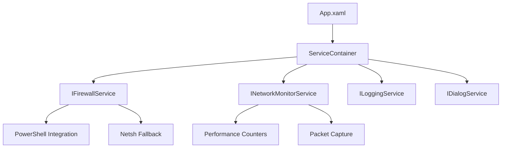

⚠️ **Disclaimer:** This project is currently under active development and in a pre-release state. Features may be unstable or subject to change. Please use with caution.

<div align="center">

# 🛡️ AppIntBlockerGUI v1.2.0

**Professional Windows Application Firewall Manager with Modern UI**

[](https://dotnet.microsoft.com/download)
[](https://www.microsoft.com/windows)
[](LICENSE)
[](https://github.com/bugragungoz/AppIntBlockerGUI/actions)
[](https://github.com/bugragungoz/AppIntBlockerGUI/releases)
[](#security)


[📦 Download Latest Release](https://github.com/bugragungoz/AppIntBlockerGUI/releases) | [📚 Documentation](docs/) | [🐛 Report Bug](https://github.com/bugragungoz/AppIntBlockerGUI/issues) | [💡 Request Feature](https://github.com/bugragungoz/AppIntBlockerGUI/issues)

</div>

## 🌟 **Key Features**

### 🔥 **Core Functionality**
- **🚫 Application Blocking**: Effortlessly block applications from network access
- **⚙️ Advanced Rule Management**: Create, edit, delete, and organize firewall rules
- **📊 Real-time Network Monitor**: Live dashboard with intelligent process analysis
- **🔄 One-Click Blocking**: Instantly block/unblock processes from network monitor
- **💾 Restore Points**: Create and restore firewall configuration snapshots
- **🎯 Windows Firewall Integration**: Direct API integration for reliable rule management

### 🧠 **Enhanced Network Intelligence**
- **🔍 Smart Service Detection**: Identifies 100+ network services (HTTP, HTTPS, SSH, FTP, etc.)
- **📈 Traffic Analytics**: Real-time bandwidth monitoring with 60-second live graphs
- **🔄 Connection Intelligence**: Advanced TCP/UDP/ICMP classification
- **⚡ Performance Counters**: Accurate per-process byte tracking
- **🛡️ Security Insights**: Identifies security-sensitive and system processes

### 🎨 **Modern User Experience**
- **🌙 Beautiful Dark Theme**: Professional, modern interface design
- **📱 Responsive UI**: Smooth animations and real-time updates
- **👨‍💼 Administrator Management**: Automatic privilege checking and elevation
- **🔄 Cancellation Support**: Cancel long-running operations
- **📊 Live Charts**: Interactive bandwidth graphs with LiveCharts2

## 🖼️ **Additional Views**

<div align="center">

| Manage Rules | Restore Points | Windows Firewall | Settings |
| :---: | :---: | :---: | :---: |
|  |  |  |  |

</div>

## 🚀 **Quick Start**

### 📋 **Prerequisites**

| Requirement | Version | Download |
|-------------|---------|----------|
| Windows | 10/11 | - |
| .NET Desktop Runtime | 8.0+ | [Download](https://dotnet.microsoft.com/download/dotnet/8.0) |
| Npcap Driver | Latest | [Download](https://npcap.com/) |
| Administrator Rights | Required | Automatic elevation |

### 📦 **Installation**

1. **Download**: Get the latest release from [GitHub Releases](https://github.com/bugragungoz/AppIntBlockerGUI/releases)
2. **Install**: Run the `.msi` installer and follow the setup wizard
3. **Configure**: Install Npcap in **WinPcap API-Compatible Mode** for network monitoring
4. **Launch**: The application will request administrator privileges automatically

### 💻 **Building from Source**

```bash
# Clone the repository
git clone https://github.com/bugragungoz/AppIntBlockerGUI.git
cd AppIntBlockerGUI

# Restore dependencies
dotnet restore

# Build the project
dotnet build --configuration Release

# Run the application
cd src && dotnet run
```

## 🏗️ **Architecture & Technology**

### 📐 **Modern Architecture**
- **🎯 MVVM Pattern**: Clean separation with ViewModels, Services, and Models
- **💉 Dependency Injection**: Microsoft.Extensions.DependencyInjection
- **🔄 Async Programming**: Full async/await implementation with cancellation support
- **🛠️ Service-Based Design**: Modular, testable, and maintainable codebase

### 🛠️ **Tech Stack**

| Component | Technology | Purpose |
|-----------|------------|---------|
| **Framework** | .NET 8.0 WPF | Cross-platform desktop framework |
| **UI Library** | MahApps.Metro | Modern, professional UI components |
| **Charts** | LiveChartsCore.SkiaSharp | Real-time data visualization |
| **Icons** | MahApps.Metro.IconPacks | Comprehensive icon sets |
| **Logging** | Serilog | Structured, high-performance logging |
| **Testing** | MSTest + Moq | Unit testing with mocking framework |
| **Network** | SharpPcap + PacketDotNet | Network packet capture and analysis |

### 🎯 **Key Services**



## 📊 **Project Structure**

```
AppIntBlockerGUI/
├── 📁 src/
│   ├── 📁 ViewModels/           # MVVM ViewModels
│   ├── 📁 Views/               # WPF Views and UserControls
│   ├── 📁 Services/            # Business logic and services
│   ├── 📁 Models/              # Data models and DTOs
│   ├── 📁 Converters/          # Value converters for data binding
│   ├── 📁 Core/                # Core interfaces and utilities
│   └── 📁 Resources/           # Themes, styles, and assets
├── 📁 Tests/                   # Unit tests and test utilities
├── 📁 docs/                    # Comprehensive documentation
│   ├── 📄 api.md              # API documentation
│   ├── 📄 security.md         # Security practices and policies
│   ├── 📄 installation.md     # Detailed installation guide
│   └── 📄 roadmap.md          # Future development plans
├── 📁 .github/workflows/       # CI/CD pipeline configurations
├── 📄 CHANGELOG.md            # Version history and changes
├── 📄 LICENSE                 # MIT license
└── 📄 README.md               # This file
```

## 🔒 **Security**

**AppIntBlockerGUI** implements multiple layers of security to protect your system:

### 🛡️ **Security Features**
- **✅ Input Validation**: Comprehensive sanitization of all user inputs
- **✅ Command Injection Protection**: Parameterized commands and argument escaping
- **✅ Path Traversal Prevention**: Robust path validation and normalization
- **✅ Privilege Management**: Secure administrator elevation handling
- **✅ System Protection**: Critical system directory and file protection

### 🔍 **Security Practices**
- **Regular Security Audits**: Automated and manual code reviews
- **Dependency Scanning**: Regular updates of all dependencies
- **Secure Coding Standards**: Following OWASP security guidelines
- **Encrypted Settings**: User settings encrypted with DPAPI

> 📖 **For detailed security information, see our [Security Policy](docs/security.md)**

## 🧪 **Testing & Quality**

### ✅ **Testing Strategy**
- **Unit Tests**: Comprehensive service layer testing with MSTest
- **Mocking**: Isolated testing with Moq framework
- **CI/CD Integration**: Automated testing on every commit
- **Performance Testing**: Memory and CPU usage optimization

### 📊 **Quality Metrics**
- **Code Coverage**: Targeting >80% coverage
- **Static Analysis**: Automated code quality checks
- **Performance**: Optimized for minimal resource usage
- **Reliability**: Robust error handling and recovery

## 📈 **Recent Updates**

### 🆕 **v1.2.0 - Enhanced Network Monitoring**
- **📊 Real-time Dashboard**: Live process bandwidth monitoring
- **📈 Interactive Charts**: 60-second bandwidth graphs
- **⚡ One-click Blocking**: Instant firewall rule creation
- **🔄 Performance Optimization**: Enhanced monitoring efficiency

### 🔧 **v1.1.0 - Reliability & Testing**
- **❌ Cancellation Support**: User-controllable long operations
- **🧪 Unit Test Suite**: Comprehensive testing framework
- **⚙️ CI/CD Pipeline**: Automated build and test processes
- **🏗️ Architecture Refactoring**: Improved testability and maintainability

> 📋 **[View Full Changelog](CHANGELOG.md)**

## 🤝 **Contributing**

We welcome contributions from the community! Here's how you can help:

### 🚀 **Getting Started**
1. **Fork** the repository
2. **Create** a feature branch: `git checkout -b feature/AmazingFeature`
3. **Commit** your changes: `git commit -m 'Add AmazingFeature'`
4. **Push** to the branch: `git push origin feature/AmazingFeature`
5. **Open** a Pull Request

### 📝 **Contribution Guidelines**
- Follow existing code style and conventions
- Add unit tests for new functionality
- Update documentation as needed
- Ensure all tests pass before submitting

## 📜 **License**

This project is licensed under the **MIT License** - see the [LICENSE](LICENSE) file for details.

## 🙏 **Acknowledgments**

### 🤖 **AI Development Partnership**
This project was developed with the assistance of advanced AI models:
- **Claude 4 Sonnet**: Architecture design, security implementation, and best practices
- **Gemini 2.5 Pro**: UI/UX optimization, documentation, and testing strategies

### 🌟 **Open Source Inspiration**
Special thanks to the [**Sniffnet**](https://github.com/GyulyVGC/sniffnet) project by Giuliano Bellini for inspiring our network monitoring capabilities and providing excellent algorithms for service detection and traffic classification.

### 🛠️ **Technology Partners**
- [**MahApps.Metro**](https://mahapps.com/) - Beautiful, modern UI framework
- [**LiveCharts**](https://livecharts.dev/) - Powerful data visualization
- [**Serilog**](https://serilog.net/) - Structured logging platform

---

<div align="center">

**⭐ If you find this project useful, please give it a star! ⭐**

[Report Bug](https://github.com/bugragungoz/AppIntBlockerGUI/issues) • [Request Feature](https://github.com/bugragungoz/AppIntBlockerGUI/issues) • [Join Discussion](https://github.com/bugragungoz/AppIntBlockerGUI/discussions)

**Made with ❤️ by the AppIntBlocker community**

</div>
